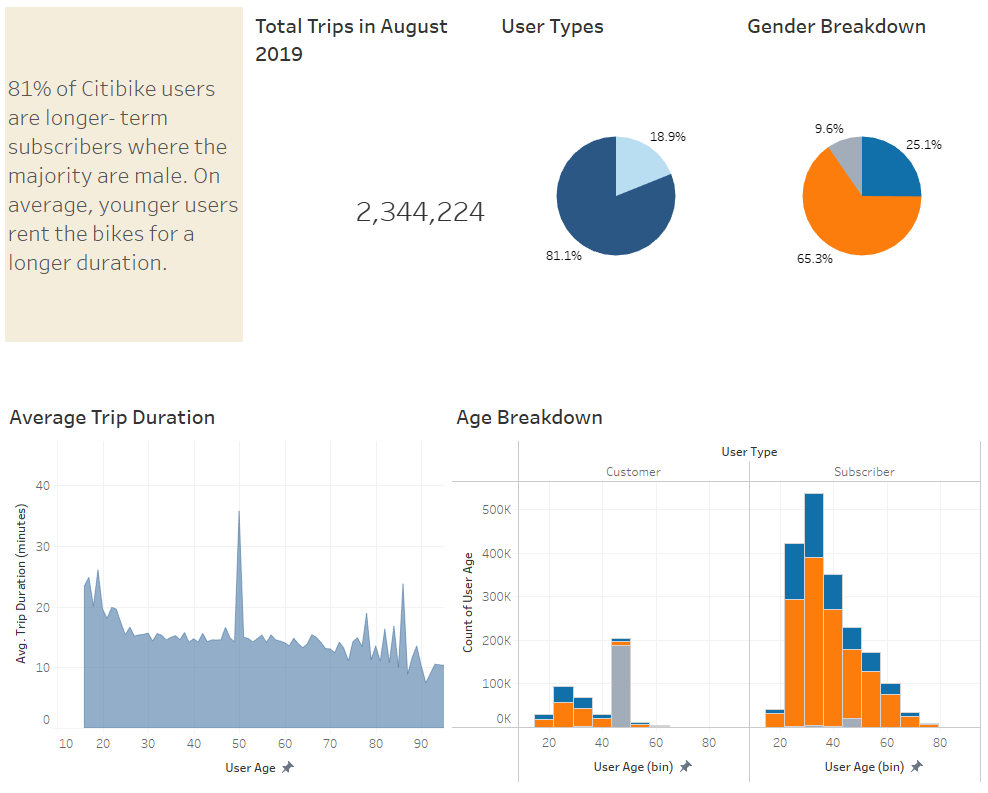
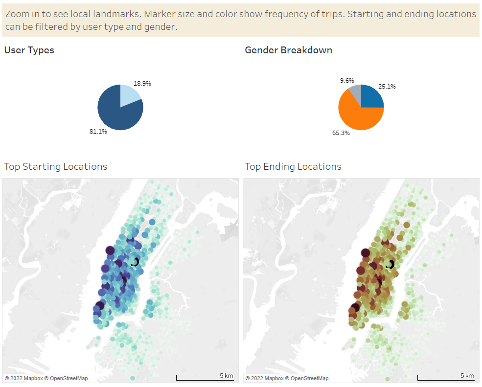
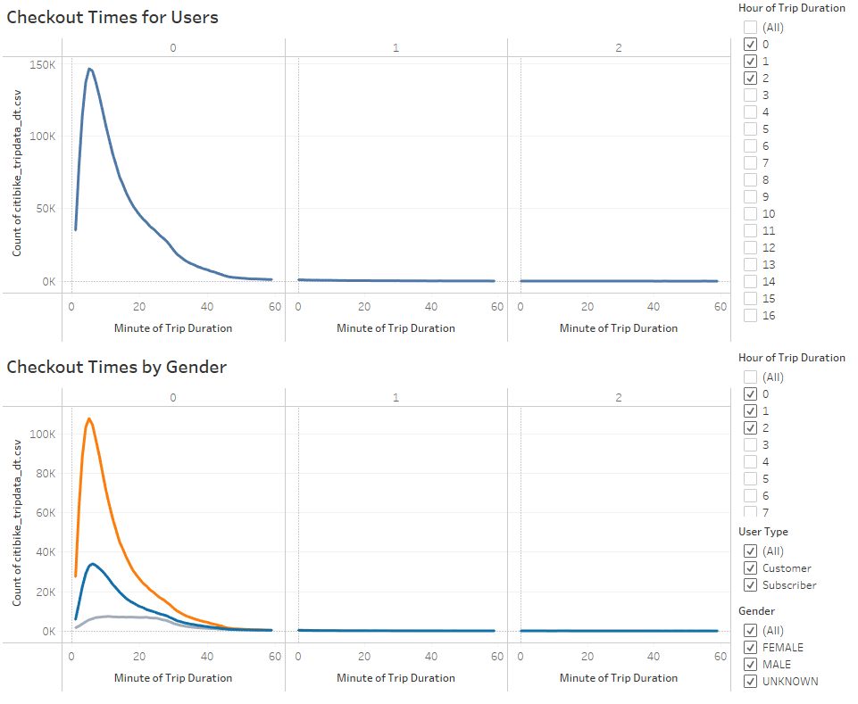
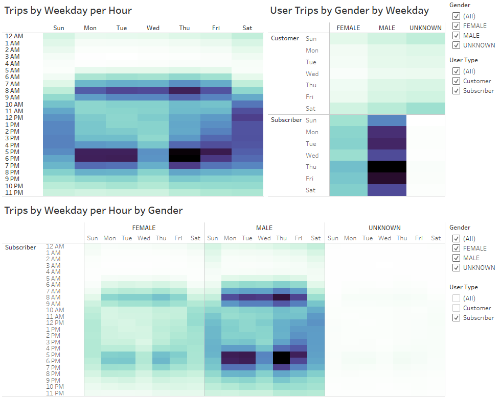

# Bikesharing Proposal

## Purpose
A [Tableau story](https://public.tableau.com/app/profile/dylan.lee7603/viz/Bikeshare_Proposal/BikeshareProposal) was assembled to visualize Citi Bike data from New York City and to propose the viability of a similar bikesharing model in Des Moines, Iowa by exploring its user base and user behaviors. 

## Results
### Who

**First story point** offers a high level breakdown of the Citi Bike user base as of August 2019, interrogating the types of users (annual Subscribers and short-term Customers) as well as their age and gender.
* Annual Subscribers are the main users, accounting for 81% of all trips in this data set.
   * 72% Male, 26% Female, 2% Unknown
* Average trip duration is consistently lower for Subscribers than Customers across all ages. 
   * Distribution of trips by age for both user types are right-skewed however a large number of Customers of unknown gender between ages 44 and 50 significantly increased average trip duration. Perhaps customers are not obligated to disclose their gender whereas subscribers are registered with the service thus disclose gender.

### Where

**Second story point** shows the frequency of bike rides at the starting and ending locations, interrogating the user types and user gender. Heat map accessible color scheme from [cube helix](https://github.com/jradavenport/cubehelix_hex). 
* The most frequent locations coincided with popular NYC sights and landmarks including Grand Central Station and Union Square.
* Subscribers' top starting and ending locations were centered around inner Manhattan where as Customer usage tended the perimeter of Central Park and North Manhattan along the Hudson River.
* Generally speaking, male/female users followed the geographical trend seen with Subscriber usage (as it is the prevailing user type). Similarly, unknown gender users follow the geographical trend for Customers.

### When

**Third story point** summarizes the frequency of users who rented a bike for a certain length of time. 
* Most users only checkout bikes for 5 minutes with a steep drop off of users as the trip duration increases.
* Breaking down checkout times by gender shows a similar trend for all user types. 
* When filtering on Customers, however, the distribution plateaus as more Customers tend to use the bikes for a longer period of time.

**Fourth story point** breaks down bike usage by weekday and hour per day. 
* At a high level, users tended to use bikes during bursts coinciding with work transit hours 7-9AM to about 5-7PM of weekdays or during the weekend with moderate usage spread over several hours (approximately 10AM to 7PM).
* Comparing user types showed Subscribers, in particular male Subscribers, significantly contributed to the 'transiting' trend whereas Customers typically rented bikes on the weekend. 

### Other Considerations
* Frequency is a nice measure to see which locations/bikes are popular but may elucidate whether those trips are profitable since Citi Bike's model relies on charging users on their initial chunk of use (30 or 45 minutes) and various rates after the initial time elapses depending on the user type. 
* The current data would benefit from the 2019 pricing model, and more granularity for the customer user type. From their [website](https://citibikenyc.com/pricing), it appears the day pass and single ride pricing options could both be classified under the customer user type but they each have different initial pricing and surcharge threshold/amounts. By applying the monetary data, we can determine whether the metrics explored here with userbase data (e.g. Trip Duration and frequency) is a good indication of revenue. 
* How has changes to userbase and pricing plans affected revenue since 2019? A time series chart with data to the current year and some landmark events would be beneficial to understand Citi Bike's growth.
